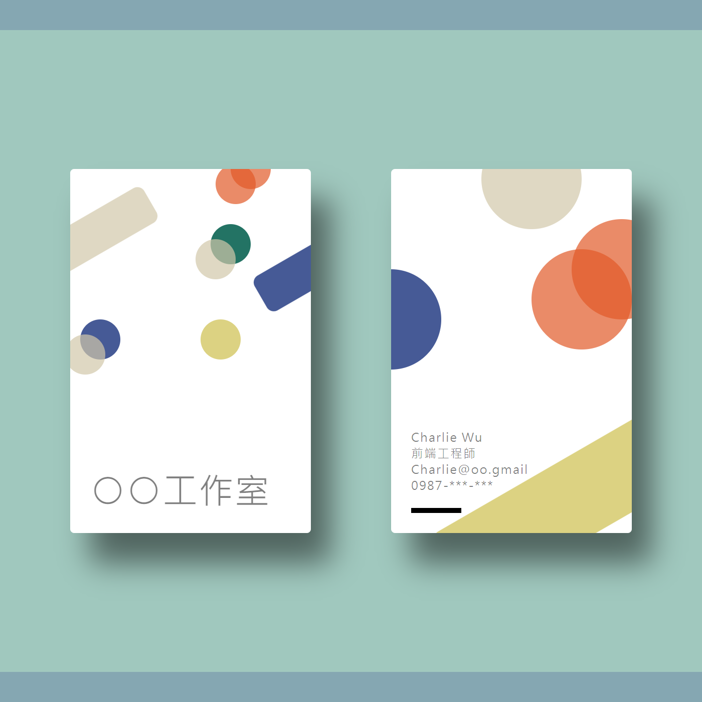

這是我的第一個網頁作品，練習應用 HTML 與 CSS 做網頁排版，網址：[在此](https://charliewuuu.github.io/business_card/)


此為 Hahow 課程「[動畫互動網頁程式入門](https://hahow.in/courses/56189df9df7b3d0b005c6639)」的作業之一，我在本作品應用了 CSS 的幾何形狀（矩形、圓角、填色、透明度）、絕對定位／相對定位、flexbox 的排版概念。




當時是初次接觸網頁開發，處於觀念尚在建立的時期，所以一些不夠完善的地方。尤其是尚未學到手機版的排版，所以無法在手機上順利展示（會過小）。

然而經過此練習，我注意到 CSS 的邏輯與繪圖軟體 Illustrator 有許多相似概念，例如：內外邊框、圓角、陰影等，這些發現對我後續的學習有許多幫助。

本作品的設計參考：[Pinterest 素材](https://www.pinterest.com/pin/188517934392232217/)


```javascript
let test = true;
```

`test`
